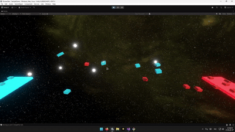

## Что реализовано

- Дроны, автоматически собирающие ресурсы и доставляющие их на базу
- Базы фракций с точками разгрузки ресурсов
- Ресурсы, спавнящиеся на сцене с заданной периодичностью через спавнер
- Простое избежание столкновений с использование триггер-коллайдера стоящим перед дроном
---

## Архитектура

### Компоненты

- **Drone**
  - Основной компонент дрона.
  - Управляет состоянием дрона через DroneStateHandler.
  - Реализует интерфейс для взаимодействия с ресурсами чтобы к ним имел доступ DroneStateHandler.

- **DroneStateHandler**
  - Логика смены состояний и самих состояний

- **DroneMovement**
  - Управляет перемещением дрона
  - Реализует уклонение от других дронов через триггеры
    
- **ResourceBase**
  - Основа для возможных различных ресурсов
  - может быть собран дроном
  - Возвращается в пул после доставки

- **Resource**
  - Конкретный ресурс

- **ResourceSpawner**
  - Периодически спавнит ресурсы с использованием пула объектов

- **ResourcePool**
  - Реализация пула объектов для ресурсов

- **ResourceManager**
  - Отслеживает активные ресурсы в сцене
  - Предоставляет ближайший доступный ресурс для дрона через интерфейс

- **FactionBase**
  - Представляет базу фракции с точками разгрузки ресурсов (`DronePort`)

- **DronesManager**
  - Инициализирует дронов для каждой фракции и расставляет их на старте

---

## Инструменты и подходы

- New Input System для управления камерой посредством перетаскивания мышкой
- InputReader читающий ввод и предоставляющий удобные события для простой работы с вводом
- Zenject - внедрение зависимостей
- Пул объектов для уменьшения затрат на создание/уничтожение ресурсов
